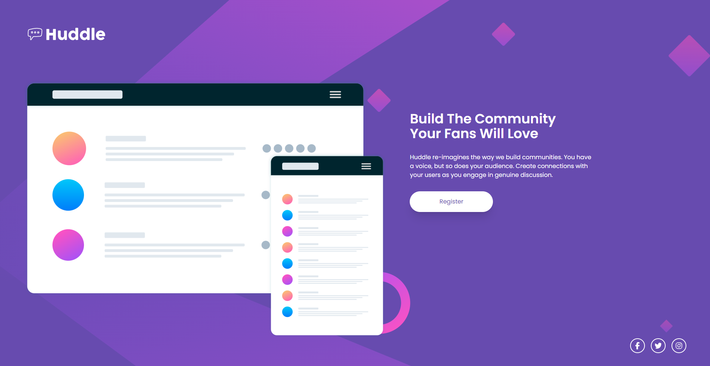

# Frontend Mentor - Huddle landing page with single introductory section solution

This is a solution to the [Huddle landing page with single introductory section challenge on Frontend Mentor](https://www.frontendmentor.io/challenges/huddle-landing-page-with-a-single-introductory-section-B_2Wvxgi0).
## Table of contents

- [Overview](#overview)
  - [The challenge](#the-challenge)
  - [Screenshot](#screenshot)
  - [Links](#links)
- [My process](#my-process)
  - [Built with](#built-with)
  - [What I learned](#what-i-learned)
  - [Continued development](#continued-development)
  - [Useful resources](#useful-resources)

## Overview

### The challenge

Users should be able to:

- View the optimal layout for the page depending on their device's screen size
- See hover states for all interactive elements on the page

### Screenshot

### Links

- Solution URL: [Github](https://github.com/Nipaaaa1/huddle-landing-page)
- Live Site URL: [Netlify](https://loquacious-cocada-2a61a6.netlify.app/)

## My process

### Built with

- Semantic HTML5 markup
- [React](https://reactjs.org/) - JS library
- [Tailwind CSS](https://tailwindcss.com/) - CSS Framework

### What I learned

Responsive is **Hard**. I know I've said it everytime but still, it is hard.

### Continued development

I want to take some challenges that have some JS in the future, so I could use React to it's fullest

### Useful resources

- [Tailwind CSS Docs](https://tailwindcss.com/docs/installation) - Helps a Lot.
